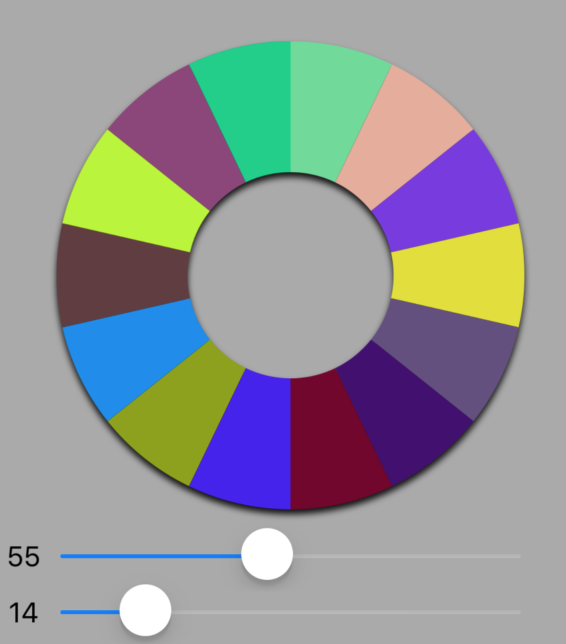

# JustPieChart

[](https://travis-ci.org/astrokin/JustPieChart)
[](https://cocoapods.org/pods/JustPieChart)
[](https://cocoapods.org/pods/JustPieChart)
[](https://cocoapods.org/pods/JustPieChart)

Simple and elegant pie chart for iOS applications



If you need any additional functionality please contact me.

If you have any questions don't hesitate to contact me.

Have a nice day! =)


## Example

To run the example project, clone the repo, and run `pod install` from the Example directory first.

## Requirements

iOS 8+

## Installation

JustPieChart is available through [CocoaPods](https://cocoapods.org). To install
it, simply add the following line to your Podfile:

```ruby
pod 'JustPieChart'
```

## Author

Alexey Strokin, alex.strok@gmail.com

## License

JustPieChart is available under the MIT license. See the LICENSE file for more info.
